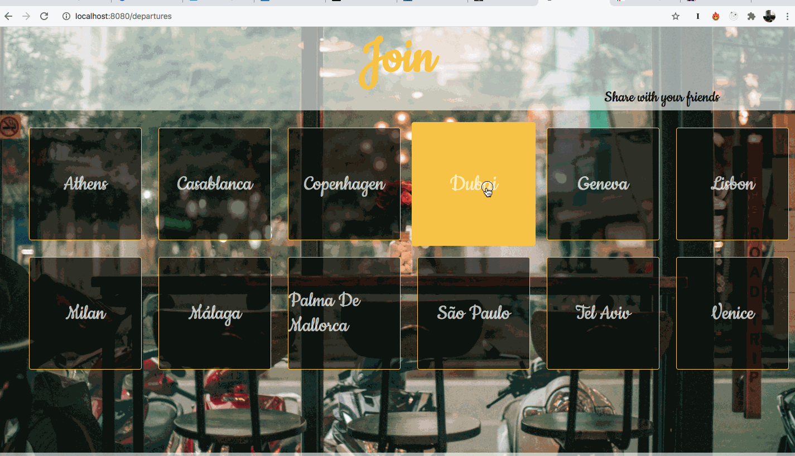

# JOIN

## What is JOIN ?

Join is a Website allowing its users to find the travel destination(s) matching to up to 5 different departure cities.

It allows users to find a common destination where there can join each other, departing from their different home cities.

---

## Developed with ...

-   Node.js
-   Express.js
-   PostgreSQL
-   Handlebars
-   HTML/CSS

---

## Features

Users are welcome with a minimalistic page with 5 input fields where they can choose between 2 to 5 different departure cities.

Once the user has chosen his departure cities, he gets to the presentation of the matching destinations.

He can now choose to share this information with his friends / travel companions.
For doing so he would first have to log in or register.

Once he successfully logged in, the user can provide up to 5 email adresses corresponding to send his travel companions the possible destination cities for a common travel.

The user can also pick one destination and then share this choice with his mates...Or get back to the homepage:

